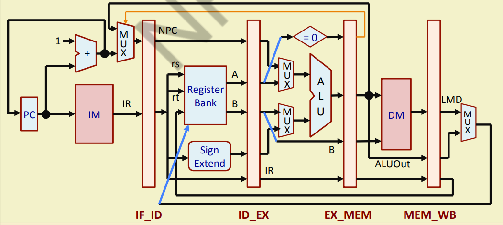

# Mips_32_processor_using_verilog
This project aims to implement a 32-bit 5-stage pipelined High-performance MIPS-based RISC Core based on Harvard Architecture. The MIPS processor was designed using MIPS ISA (Instruction Set Architecture) and divided into three main modules: datapath unit, control unit, and hazard unit. The processor is tested to run two programs: GCD Calculation of two numbers and Factorial Calculation of a number. Programs are written in MIPS assembly code, then converted to machine code. Verilog HDL language is used on Vivado 2022.2 Simulation tool to verify the functional simulation of the processor and compare between five-stage pipelined MIPS processor and single-cycle MIPS processor regarding performance analysis. 
Keywords: Pipelined MIPS Processor, Harvard Architecture, MIPS Assembly, Functional Simulation, Datapath, Hazard Unit.

- Following is the block diagram for our pipeline processor.

